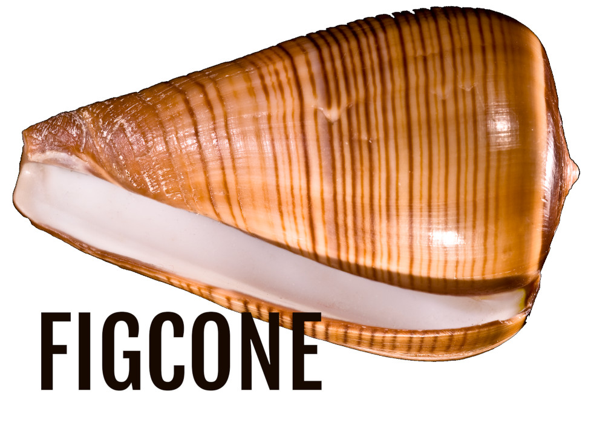

<p align="center">
    
</p>

[](https://github.com/kamchatka-volcano/figcone/actions/workflows/build_and_test.yml)

`figcone` - is a C++17 library, providing a convenient declarative interface for configuration parsers and built-in support for reading `JSON`, `YAML`, `TOML`, `XML`, `INI` and `shoal` config files. To use it, create a configuration schema by declaring a structure for each level of your config file and load it by calling a method, matching the preferred configuration format:

```C++
///examples/ex01.cpp
///
#include <figcone/configreader.h>
#include <filesystem>
#include <iostream>
#include <vector>

struct ThumbnailCfg : public figcone::Config
{
    int maxWidth = param<&ThumbnailCfg::maxWidth>();
    int maxHeight = param<&ThumbnailCfg::maxHeight>();
};
struct PhotoViewerCfg : public figcone::Config{
    //config fields can also be created with macros:
    FIGCONE_PARAM(rootDir, std::filesystem::path);
    FIGCONE_PARAMLIST(supportedFiles, std::vector<std::string>);
    FIGCONE_NODE(thumbnailSettings, ThumbnailCfg);
};

int main()
{
    auto cfgReader = figcone::ConfigReader{};
    auto cfg = cfgReader.readToml<PhotoViewerCfg>(R"(
        rootDir = "~/Photos"
        supportedFiles = [".jpg", ".png"]
        [thumbnailSettings]
          maxWidth = 256
          maxHeight = 256
    )");
    //At this point your config is ready to use
    std::cout << "Launching PhotoViewer in directory " << cfg.rootDir << std::endl;
    return 0;
}
```

## Table of Contents
* [Usage](#usage)
     * [Config structure](#Config-structure)
     * [Supporting non-aggregate config structures](#supporting-non-aggregate-config-structures)
     * [Registration without macros](#registration-without-macros) 
     * [Supported formats](#supported-formats)
          * [JSON](#json)
          * [YAML](#yaml)
          * [TOML](#toml)
          * [XML](#xml)
          * [INI](#ini)
          * [shoal](#shoal)
     * [Creation of figcone-compatible parsers](#creation-of-figcone-compatible-parsers)  
     * [User defined types](#user-defined-types)
  * [Validators](#validators)
  * [Post-processors](#post-processors)
* [Installation](#installation)
* [Running tests](#running-tests)
* [Building examples](#building-examples)   
* [License](#license)

## Usage


### Config structure

To use `figcone`, you need to create a structure with fields corresponding to the config's parameters.  
To do this, subclass `figcone::Config` and declare fields using the following macros:

- **FIGCONE_PARAM(`name`, `type`)** - creates a `type name;` config field and registers it in the parser.
- **FIGCONE_PARAMLIST(`name`, `listType`)** - creates a `listType name;` config field and registers it in the parser. listType can be any sequence container that supports the `emplace_back` operation, such as `vector`, `deque`, or `list` from the STL.
- **FIGCONE_NODE(`name`, `type`)** - creates a `type name;` config field for a nested configuration structure and registers it in the parser. The type of the name field must be a subclass of `figcone::Config`.
- **FIGCONE_NODELIST(`name`, `listType`)** - creates a `listType name;` config field for a list of nested configuration structures and registers it in the parser. `listType` can be any sequence container that supports the `emplace_back` operation, such as `vector`, `deque`, or `list` from the STL. The type stored in the list (listType::value_type) must be a subclass of `figcone::Config`.
- **FIGCONE_COPY_NODELIST(`name`, `listType`)** - creates a `listType name;` config field for a list of nested configuration structures and registers it in the parser. `listType` can be any sequence container that supports the `emplace_back` operation, such as `vector`, `deque`, or `list` from the STL. The type stored in the list (listType::value_type) must be a subclass of `figcone::Config`. The first element of this list acts as a template for the other elements, which means that all unspecified parameters of the second and following elements will be copied from the first element without raising a parsing error for missing parameters.
- **FIGCONE_DICT(`name`, `mapType`)** - creates a `mapType name;` config field for a nested dictionary and registers it in the parser. `mapType` can be any associative container that supports the emplace operation, such as `map` or `unordered_map` from the STL. The key type of the map must be `std::string`  
The preprocessor doesn't handle commas between template arguments in the correct way, so you need to create an alias for your map in order to use it with this macro:
 ```c++
    using StringMap = std::map<std::string, std::string>;
    FIGCONE_DICT(testDict, StringMap);
 ```

Notes:
- All config entities listed above provide the parenthesis operator `()` which sets the default value and makes this config field optional. This means that the field can be omitted from the configuration file without raising an error. The empty `operator ()` makes a field's value default initialized, otherwise the passed parameters are used for initialization. `FIGCONE_NODE`, `FIGCONE_NODELIST`, and `FIGCONE_COPY_NODELIST` only support default initialization.
- It is also possible to make any config field optional by placing it in `figcone::optional` (a `std::optional`-like wrapper with a similar interface). If a value for this field is missing from the config file, the field remains uninitialized and no error occurs.
- Types used for config parameters must be default constructible and copyable.

You do not need to change your code style when declaring config fields. `camelCase`, `snake_case`, and `PascalCase` names are supported, and can be converted to the format used by parameter names in the config file. To do this, specify the configuration names format with the `figcone::NameFormat` enum by passing its value to the `figcone::ConfigReader` template argument. 

To demonstrate it, let's change our PhotoViewer example to use snake_case names in the configuration:

```C++
///examples/ex02.cpp
///
#include <figcone/configreader.h>
#include <filesystem>
#include <iostream>
#include <vector>

struct ThumbnailCfg : public figcone::Config
{
    int maxWidth = param<&ThumbnailCfg::maxWidth>();
    int maxHeight = param<&ThumbnailCfg::maxHeight>();
};
struct PhotoViewerCfg : public figcone::Config
{
    //config fields can also be created with macros:
    FIGCONE_PARAM(rootDir, std::filesystem::path);
    FIGCONE_PARAMLIST(supportedFiles, std::vector<std::string>);
    FIGCONE_NODE(thumbnailSettings, ThumbnailCfg);
};

int main()
{
    auto cfgReader = figcone::ConfigReader<figcone::NameFormat::SnakeCase>{};
    auto cfg = cfgReader.readToml<PhotoViewerCfg>(R"(
        root_dir = "/home/kamchatka-volcano/photos"
        supported_files = [".jpg", ".png"]
        [thumbnail_settings]
          max_width = 256
          max_height = 256
    )");
    //At this point your config is ready to use
    std::cout << "Launching PhotoViewer in directory " << cfg.rootDir << std::endl;
    return 0;
}
```

### Supporting non-aggregate config structures
`figcone` relies on aggregate initialization of user-provided structures. If your config object needs to contain private data or virtual functions, it becomes a non-aggregate type. In this case, you must use the following `using` declaration to inherit `figcone::Config`'s constructors: `using Config::Config;`
```cpp
struct PhotoViewerCfg : public figcone::Config
{
    using Config::Config;
    virtual ~PhotoViewerCfg() = default; //virtual destructor makes PhotoViewerCfg non-aggregate
    FIGCONE_PARAM(rootDir, std::filesystem::path);
    FIGCONE_PARAMLIST(supportedFiles, std::vector<std::string>);
    FIGCONE_NODE(thumbnailSettings, ThumbnailCfg);
};
```

### Registration without macros
`figcone` can be used without macros, as every configuration entity described earlier can be registered with the similarly named `figcone::Config`'s member templates:
```c++
    struct Cfg : public figcone::Config{
        int testParam                      = param<&Cfg::testParam>();
        int testParam2                     = param<&Cfg::testParam2>()(100);
        figcone::optional<int> testParam3      = param<&Cfg::testParam3>();
        std::vector<double> testParamList  = paramList<&Cfg::testParamList>();
        TestNode testNode                  = node<&Cfg::testNode>();
        figcone::optional<TestNode> testNode2  = node<&Cfg::testNode2>();
        std::vector<TestNode> testNodeList = nodeList<&Cfg::testNodeList>();
        std::vector<TestNode> copyTestNodeList = copyNodeList<&Cfg::copyTestNodeList>();
        std::map<std::string, std::string> testDict = dict<&Cfg::testDict>();
    };
```
Internally, these methods use the [`nameof`](https://github.com/Neargye/nameof) library to get config fields' names as strings. By default, `figcone` ships without it, so these methods aren't available. To use them, enable the `FIGCONE_USE_NAMEOF` CMake option to automatically download and configure the nameof library, or install it on your system manually.

Note that nameof relies on non-standard functionality of C++ compilers, so if you don't like it, you can use `figcone` without it by providing names for config fields yourself:

```c++
    struct Cfg : public figcone::Config{
        int testParam                          = param<&Cfg::testParam>("testParam");
        int testParam2                         = param<&Cfg::testParam2>("testParam2")(100);
        figcone::optional<int> testParam3      = param<&Cfg::testParam3>("testParam3");
        std::vector<double> testParamList      = paramList<&Cfg::testParamList>("testParamList");
        TestNode testNode                      = node<&Cfg::testNode>("testNode");
        figcone::optional<TestNode> testNode2  = node<&Cfg::testNode2>("testNode2");
        std::vector<TestNode> testNodeList     = nodeList<&Cfg::testNodeList>("testNodeList");
        std::vector<TestNode> copyTestNodeList = copyNodeList<&Cfg::copyTestNodeList>("copyTestNodeList");
        std::map<std::string, std::string> testDict = dict<&Cfg::testDict>("testDict");
    };
```
Please note that on the MSVC compiler, the `nameof` features used by `figcone` require the C++20 standard. This is handled automatically by CMake configuration if MSVC is your default compiler. Otherwise, you will need to enable the C++20 standard manually.

Config structures declared using the macro-free methods are fully compatible with all of `figcone`'s functionality. Examples in the documentation use registration with macros, as it is the least verbose method. 


### Supported formats
 
Internally, the `figcone` library works on a tree-like structure provided by the [`figcone_tree`](https://github.com/kamchatka-volcano/figcone_tree) library, and it is not aware of different configuration formats. The user needs to provide a parser implementing the `figcone_tree::IParser` interface to convert a configuration file to a tree structure based on the `figcone_tree::TreeNode` class. It is also possible to create a `figcone` compatible parser adapter that transforms the parsing result of some 3rd party configuration parsing library to a tree using `figcone_tree::TreeNode`. Five such adapters for popular configuration formats are included in `figcone`, and are fetched and built into a static library called `figcone_formats` which is automatically configured and linked by `figcone`'s CMake configuration. An obscure configuration format called [`shoal`](https://github.com/kamchatka-volcano/figcone_shoal), which was designed by the author of `figcone`, is also available and can be used as an example of an original parser implementation that is compatible with `figcone`.

Let's increase the complexity of our example config to demonstrate how configuration elements work with each format:

#### demo.h
```C++
///examples/demo.h
///
#pragma once
#include <figcone/config.h>
#include <figcone/shortmacros.h> //enables macros without FIGCONE_ prefix
#include <string>
#include <vector>
#include <map>

struct ThumbnailCfg : public figcone::Config
{
    PARAM(enabled, bool)(true);
    PARAM(maxWidth, int);
    PARAM(maxHeight, int);
};
struct HostCfg : public figcone::Config{
    PARAM(ip, std::string);
    PARAM(port, int);
};
struct SharedAlbumCfg : public figcone::Config{
    PARAM(dir, std::filesystem::path);
    PARAM(name, std::string);
    NODELIST(hosts, std::vector<HostCfg>)();
};
struct PhotoViewerCfg : public figcone::Config{
    PARAM(rootDir, std::filesystem::path);
    PARAMLIST(supportedFiles, std::vector<std::string>);
    NODE(thumbnails, ThumbnailCfg);
    COPY_NODELIST(sharedAlbums, std::vector<SharedAlbumCfg>)();
    using StringMap = std::map<std::string, std::string>;
    DICT(envVars, StringMap)();
};
```

#### JSON

JSON support is provided by [`nlohmann/json`](https://github.com/nlohmann/json) library which is fetched and adapted to the `figcone` interface by the [`figcone_json`](https://github.com/kamchatka-volcano/figcone_json) library.

A JSON config that matches the configuration listed in [`demo.h`](#demoh) earlier, looks like this:

`demo.json`
```json
{
  "rootDir": "~/Photos",
  "supportedFiles": [
    ".jpg",
    "png"
  ],
  "thumbnails": {
    "enabled": "1",
    "maxWidth": "128",
    "maxHeight": "128"
  },
  "sharedAlbums": [
    {
      "dir": "summer_2019",
      "name": "Summer (2019)",
      "hosts" : [{"ip" : "127.0.0.1", "port" : "8080" }]
    },
    {
      "dir": "misc",
      "name": "Misc"
    }
  ],
  "envVars": {
    "DISPLAY" : "0.1"
  }
}
```

```C++
///examples/demo_json.cpp
///
#include "demo.h"
#include <figcone/configreader.h>
#include <iostream>

int main()
{
    auto cfgReader = figcone::ConfigReader{};
    auto cfg = cfgReader.readJsonFile<PhotoViewerCfg>(std::filesystem::canonical("../../examples/demo.json"));
    std::cout << "Launching PhotoViewer in directory" << cfg.rootDir << std::endl;
    return 0;
}
```


#### YAML

YAML support is provided by the [`rapidyaml`](https://github.com/biojppm/rapidyaml) library which is fetched and adapted to the `figcone` interface by the [`figcone_yaml`](https://github.com/kamchatka-volcano/figcone_yaml) library.

A YAML config that matches the configuration listed in [`demo.h`](#demoh) earlier, looks like this:  
`demo.yaml`
```yaml
  rootDir: ~/Photos
  supportedFiles: [ ".jpg", "png"]
  thumbnails:
    enabled: 1
    maxWidth: 128
    maxHeight: 128
  
  sharedAlbums:
    -
      dir: "summer_2019"
      name: "Summer (2019)"
      hosts: 
        -
          ip: "127.0.0.1"
          port: 8080
    -    
      dir: "misc"
      name: "Misc"      
  envVars: 
    DISPLAY : "0.1"
```
```c++
///examples/demo_yaml.cpp
///
#include "demo.h"
#include <figcone/configreader.h>
#include <iostream>

int main()
{
    auto cfgReader = figcone::ConfigReader{};
    auto cfg = cfgReader.readYamlFile<PhotoViewerCfg>(std::filesystem::canonical("../../examples/demo.yaml"));
    std::cout << "Launching PhotoViewer in directory" << cfg.rootDir << std::endl;
    return 0;
}
```
Notes:  
* `figcone_yaml` supports only a single document section (starting with `---`) in your YAML config file.

#### TOML

TOML support is provided by the [`toml11`](https://github.com/ToruNiina/toml11) library which is fetched and adapted to the `figcone` interface by the [`figcone_toml`](https://github.com/kamchatka-volcano/figcone_toml) library.

A TOML config that matches the configuration listed in [`demo.h`](#demoh) earlier, looks like this:  
`demo.toml`
```toml
  rootDir = "~/Photos"
  supportedFiles = [ ".jpg", "png"]
  [thumbnails]
    enabled = 1
    maxWidth = 128
    maxHeight = 128
  
  [[sharedAlbums]]
    dir  = "summer_2019"
    name = "Summer (2019)"
    [[sharedAlbums.hosts]]
      ip = "127.0.0.1"
      port = 8080 
  [[sharedAlbums]]
      dir  = "misc"
      name = "Misc"      
  [envVars] 
    DISPLAY = "0.1"
```
```c++
///examples/demo_toml.cpp
///
#include "demo.h"
#include <figcone/configreader.h>
#include <iostream>

int main()
{
    auto cfgReader = figcone::ConfigReader{};
    auto cfg = cfgReader.readTomlFile<PhotoViewerCfg>(std::filesystem::canonical("../../examples/demo.toml"));
    std::cout << "Launching PhotoViewer in directory" << cfg.rootDir << std::endl;
    return 0;
}
```
Notes:
* TOML nested arrays aren't supported, as they can't be represented within `figcone` configuration tree.
* TOML datetime types can be used in the config by including `<figcone/format/toml/datetime.h>` header:
```C++
#include <figcone/config.h>
#include <figcone/format/toml/datetime.h>

struct Cfg: figcone::Config
{   
    FICONE_PARAM(date, figcone::toml::DateTimePoint);
    FICONE_PARAM(time, figcone::toml::TimeDuration);
};
```

`figcone::toml::DateTimePoint` is used to read TOML `local_date (2018-12-23)`, 
`local_datetime (2018-12-23T12:30:00)` and `offset_datetime (2018-12-23T12:30:00+09:30)` values.  
`figcone::toml::TimeDuration` is used to read TOML `time (12:30:00)` values.


#### XML

XML support is provided by the [`rapidxml`](https://github.com/dwd/rapidxml) library which is fetched and adapted to the `figcone` interface by the [`figcone_xml`](https://github.com/kamchatka-volcano/figcone_xml) library.

An XML config that matches the configuration listed in [`demo.h`](#demoh) earlier, looks like this:  
`demo.xml`
```xml
<root rootDir="~/Photos"
      supportedFiles = "[ '.jpg', 'png']">
    <thumbnails enabled = "1"
                maxWidth = "128"
                maxHeight = "128" />
    <sharedAlbums>
      <_ dir  = "summer_2019"
         name = "Summer (2019)">
        <hosts>
          <_ ip = "127.0.0.1"
             port = "8080"/>  
        </hosts>
      </_>
      <_ dir  = "misc"
         name = "Misc"/>
    </sharedAlbums>
  <envVars DISPLAY = "0.1"/>
</root>
```
```c++
///examples/demo_xml.cpp
///
#include "demo.h"
#include <figcone/configreader.h>
#include <iostream>

int main()
{
    auto cfgReader = figcone::ConfigReader{};
    auto cfg = cfgReader.readXmlFile<PhotoViewerCfg>(std::filesystem::canonical("../../examples/demo.xml"));
    std::cout << "Launching PhotoViewer in directory" << cfg.rootDir << std::endl;
    return 0;
}
```
Notes:
* Node lists are created by adding an attribute `_list="1"` or placing child elements in XML elements with tag name `_` : `<_> </_>`
* Parameter lists are stored in attributes and have the format: `[value1, value2, ...]`

#### INI

INI support is provided by the [`inifile-cpp`](https://github.com/Rookfighter/inifile-cpp) library which is fetched and adapted to the `figcone` interface by the [`figcone_ini`](https://github.com/kamchatka-volcano/figcone_ini) library.

An INI config that matches the configuration listed in [`demo.h`](#demoh) earlier, looks like this:  
`demo.ini`
```ini
rootDir = "~/Photos"
supportedFiles = [".jpg", "png"]
[thumbnails]
  enabled = 1
  maxWidth = 128
  maxHeight = 12
[sharedAlbums.0]
  dir  = "summer_2019"
  name = "Summer (2019)"
  [sharedAlbums.0.hosts.0]
    ip = "127.0.0.1"
    port = 8080
[sharedAlbums.1]
  dir  = "misc"
  name = "Misc"
[envVars]
DISPLAY = "0.1"
```
```c++
///examples/demo_ini.cpp
///
#include "demo.h"
#include <figcone/configreader.h>
#include <iostream>

int main()
{
    auto cfgReader = figcone::ConfigReader{};
    auto cfg = cfgReader.readIniFile<PhotoViewerCfg>(std::filesystem::canonical("../../examples/demo.ini"));
    std::cout << "Launching PhotoViewer in directory" << cfg.rootDir << std::endl;
    return 0;
}
```
Notes:
* Nested structures can be created by using dotted ini section names listing the full hierarchy: `[grandparent.parent.child]`  
* Node lists can be created by using indices in dotted ini section names, starting with zero for the first element: `[nodelist.0]`
* Parameter lists have the format: `[value1, value2, ...]`
* Multiline values aren't supported.

#### shoal

[`shoal`](https://github.com/kamchatka-volcano/shoal) support is provided by the [`figcone_shoal`](https://github.com/kamchatka-volcano/figcone_shoal) library.

A shoal config that matches the configuration listed in [`demo.h`](#demoh) earlier, looks like this:  
`demo.shoal`
```
rootDir = "~/Photos"
supportedFiles = [ ".jpg", "png"]
#thumbnails:
  enabled = 1
  maxWidth = 128
  maxHeight = 128
---

#sharedAlbums:
###
  dir  = "summer_2019"
  name = "Summer (2019)"
  #hosts:
  ###
    ip = "127.0.0.1"
    port = 8080
  -
###
  dir  = "misc"
  name = "Misc"
---

#envVars:
  DISPLAY = "0.1"
```
```c++
///examples/demo_shoal.cpp
///
#include "demo.h"
#include "print_demo.h"
#include <figcone/configreader.h>
#include <iostream>

int main()
{
    auto cfgReader = figcone::ConfigReader{};
    auto cfg = cfgReader.readShoalFile<PhotoViewerCfg>(std::filesystem::canonical("../../examples/demo.shoal"));
    std::cout << "Launching PhotoViewer in directory" << cfg.rootDir << std::endl;
    printDemoConfig(cfg);
    return 0;
}
```

### Creation of figcone-compatible parsers
To create a parser compatible with `figcone`, you will need to use the [`figcone_tree`](https://github.com/kamchatka-volcano/figcone_tree) library, which provides all the necessary types and interfaces for this task. The parsing class should implement the `figcone::IParser` interface and return the result of the configuration parsing in the form of a tree-like structure, constructed using `figcone::TreeNode` and `figcone::TreeParam` objects. Let's demonstrate how to work with the `figcone_tree` library by creating a fake parser that provides a configuration tree for the demo structure listed in [`demo.h`](#demoh):

```C++
///examples/demo_parser.cpp
///
#include "demo.h"
#include <figcone_tree/iparser.h>
#include <figcone_tree/tree.h>
#include <figcone_tree/errors.h>
#include <figcone/configreader.h>

class DemoTreeProvider : public figcone::IParser
{
    figcone::TreeNode parse(std::istream& stream) final
    {
        auto tree = figcone::makeTreeRoot();
        tree.asItem().addParam("rootDir", "~/Photos");
        tree.asItem().addParamList("supportedFiles", {".jpg", ".png"});

        auto& thumbNode = tree.asItem().addNode("thumbnails");
        thumbNode.asItem().addParam("enabled", "1");
        thumbNode.asItem().addParam("maxWidth", "128");
        thumbNode.asItem().addParam("maxHeight", "128");

        auto& albumsNodeList = tree.asItem().addNodeList("sharedAlbums");
        auto& albumNode = albumsNodeList.asList().addNode();
        albumNode.asItem().addParam("dir", "summer_2019");
        albumNode.asItem().addParam("name", "Summer (2019)");
        auto& hostsNodeList = albumNode.asItem().addNodeList("hosts");
        auto& hostNode = hostsNodeList.asList().addNode();
        hostNode.asItem().addParam("ip", "127.0.0.1");
        hostNode.asItem().addParam("port", "80");

        //For error notifications use figcone::ConfigError exceptions
        if (stream.bad())
            throw figcone::ConfigError{"stream error"};

        //Stream position information can be added to objects
        auto pos = figcone::StreamPosition{13, 1};
        auto& envVarsNode = tree.asItem().addNode("envVars", pos);
        envVarsNode.asItem().addParam("DISPLAY", "0.1");

        //and to ConfigError exceptions
        if (stream.fail())
            throw figcone::ConfigError{"stream error", pos};

        return tree;
    }
};

int main()
{
    auto cfgReader = figcone::ConfigReader{};
    auto parser = DemoTreeProvider{};
    auto cfg = cfgReader.read<PhotoViewerCfg>("", parser);
    std::cout << "Launching PhotoViewer in directory " << cfg.rootDir;
    return 0;
}
```


### User defined types
To use user-defined types in your config, it's necessary to add a specialization of the struct `figcone::StringConverter` and implement its static method `fromString`.   
Let's replace the HostCfg config structure with a parameter of type Host that is stored in the config as a string `"ipAddress:port"`.

```C++
///examples/ex03.cpp
///
#include <figcone/configreader.h>
#include <figcone/shortmacros.h> //enables macros without FIGCONE_ prefix
#include <filesystem>
#include <iostream>
#include <vector>
#include <map>

struct Host{
    std::string ip;
    int port;
};

namespace figcone{
template<>
struct StringConverter<Host>{
    static std::optional<Host> fromString(const std::string& data)
    {
        auto delimPos = data.find(':');
        if (delimPos == std::string::npos)
            return {};
        auto host = Host{};
        host.ip = data.substr(0, delimPos);
        host.port = std::stoi(data.substr(delimPos + 1, data.size() - delimPos - 1));
        return host;
    }
};
}
struct SharedAlbumCfg : public figcone::Config{
    PARAM(dir, std::filesystem::path);
    PARAM(name, std::string);
    PARAMLIST(hosts, std::vector<Host>)();
};
struct PhotoViewerCfg : public figcone::Config{
    PARAM(rootDir, std::filesystem::path);
    PARAMLIST(supportedFiles, std::vector<std::string>);
    COPY_NODELIST(sharedAlbums, std::vector<SharedAlbumCfg>)();
    using StringMap = std::map<std::string, std::string>;
    DICT(envVars, StringMap)();
};

int main()
{
    auto cfgReader = figcone::ConfigReader{};
    auto cfg = cfgReader.readYaml<PhotoViewerCfg>(R"(
      rootDir: ~/Photos
      supportedFiles: [ ".jpg", "png"]
      sharedAlbums:
        -
          dir: "summer_2019"
          name: "Summer 2019"
          hosts: ["127.0.0.1:8080"]
    )");

    std::cout << "Launching PhotoViewer in directory " << cfg.rootDir << std::endl;

    if (!cfg.supportedFiles.empty())
        std::cout << "Supported files:" << std::endl;
    for (const auto& file : cfg.supportedFiles)
        std::cout << "  " << file << std::endl;

    if (!cfg.sharedAlbums.empty())
        std::cout << "Shared albums:" << std::endl;
    for (const auto& album : cfg.sharedAlbums){
        std::cout << "  Album:" << album.name << std::endl;
        std::cout << "    Hosts:" << std::endl;
        for (const auto& host : album.hosts)
            std::cout << "      " << host.ip << ":" << host.port << std::endl;
    }

    return 0;
}
```

To provide additional information in the error message of the `StringConverter`, you can use
the `figcone::ValidationError` exception:

```cpp
namespace figcone{
template<>
struct StringConverter<Host>{
    static std::optional<Host> fromString(const std::string& data)
    {
        auto delimPos = data.find(':');
        if (delimPos == std::string::npos)
            throw ValidationError{"the host parameter must be in the format 'ipAddress:port'"};
        auto host = Host{};
        host.ip = data.substr(0, delimPos);
        host.port = std::stoi(data.substr(delimPos + 1, data.size() - delimPos - 1));
        return host;
    }
};
}
```

### Validators

Processed config parameters and nodes can be validated by registering constraint-checking functions or callable objects.
The signature must be compatible with `void (const T&)` where `T` is the type of a validated config structure
field `T value` or an optional field `figcone::optional<T>` (validators of optional fields aren't invoked if they are
empty).   
If the option's value is invalid, the validator must throw a `figcone::ValidationError` exception:

```c++
struct Cfg : figcone::Config<>{
    FIGCONE_PARAM(number, int).ensure( 
        [](int paramValue){
            if (paramValue < 0)
                throw figcone::ValidationError{"value can't be negative."};
        });
};
```

Let's improve the PhotoViewer program by checking that `rootDir` path exists and `supportedFiles`  parameter list isn't empty:
```c++
///examples/ex04.cpp
///
#include <figcone/configreader.h>
#include <figcone/shortmacros.h>
#include <filesystem>
#include <iostream>
#include <vector>
#include<map>

struct NotEmpty{
    template<typename TList>
    void operator()(const TList& list)
    {
        if (!list.empty())
            throw figcone::ValidationError{"can't be empty."};
    }
};

struct PhotoViewerCfg : public figcone::Config{
    PARAM(rootDir, std::filesystem::path).ensure([](const auto& path) {
        if (!std::filesystem::exists(path))
            throw figcone::ValidationError{"a path must exist"};
    });
    PARAMLIST(supportedFiles, std::vector<std::string>).ensure<NotEmpty>();
    using StringMap = std::map<std::string, std::string>;
    DICT(envVars, StringMap)();
};

int main()
{
    try {
        auto cfgReader = figcone::ConfigReader{};
        auto cfg = cfgReader.readYaml<PhotoViewerCfg>(R"(
            rootDir: ~/Photos
            supportedFiles: []
        )");

        std::cout << "Launching PhotoViewer in directory " << cfg.rootDir << std::endl;

        if (!cfg.supportedFiles.empty())
            std::cout << "Supported files:" << std::endl;
        for (const auto& file : cfg.supportedFiles)
            std::cout << "  " << file << std::endl;

        return 0;
    }
    catch(const figcone::ConfigError& e){
        std::cout << "Config error:" << e.what();
        return 1;
    }
}
```

Now the `read` method will throw an exception if configuration provides invalid `rootDir` or `supportedFiles`
parameters.

### Post-processors

If you need to modify or validate the config object that is produced by `figcone::ConfigReader`, you can register
the necessary action by creating a specialization of the `figcone::PostProcessor` class template:

```cpp
///examples/ex05.cpp
///
struct ThumbnailCfg : public figcone::Config
{
    FIGCONE_PARAM(maxWidth, int);
    FIGCONE_PARAM(maxHeight, int);
};

struct PhotoViewerCfg : public figcone::Config{
    FIGCONE_PARAM(rootDir, std::filesystem::path);
    FIGCONE_PARAMLIST(supportedFiles, std::vector<std::string>);
    FIGCONE_NODE(thumbnailSettings, ThumbnailCfg);
};

namespace figcone{
    template<>
    void PostProcessor<PhotoViewerCfg>::operator()(PhotoViewerCfg& cfg)
    {
        auto supportPng = std::find(cfg.supportedFiles.begin(), cfg.supportedFiles.end(), ".png") != cfg.supportedFiles.end();
        if (supportPng && cfg.thumbnailSettings.maxWidth > 128)
            throw ValidationError{"thumbnail width can't be larger than 128px when png images are present"};

    }
}
}
```

## Installation

Download and link the library from your project's CMakeLists.txt:

```
cmake_minimum_required(VERSION 3.14)

include(FetchContent)
FetchContent_Declare(figcone
    GIT_REPOSITORY "https://github.com/kamchatka-volcano/figcone.git"
    GIT_TAG "origin/master"
)
#uncomment if you need to install figcone with your target
#set(INSTALL_FIGCONE ON)
FetchContent_MakeAvailable(figcone)

add_executable(${PROJECT_NAME})
target_link_libraries(${PROJECT_NAME} PRIVATE figcone::figcone)
```

By default `figcone` fetches all supported configuration format libraries. You can control this with CMake option `FIGCONE_USE_ALL`. You can also enable support for a single configuration format or a combination of formats  by setting the following options:
  * `FIGCONE_USE_JSON` - fetches and configures the `figcone_json` library;
  * `FIGCONE_USE_YAML` - fetches and configures the `figcone_yaml` library;
  * `FIGCONE_USE_TOML` - fetches and configures the `figcone_toml` library;
  * `FIGCONE_USE_XML` - fetches and configures the `figcone_xml` library;
  * `FIGCONE_USE_INI` - fetches and configures the `figcone_ini` library;
  * `FIGCONE_USE_SHOAL` - fetches and configures the `figcone_shoal` library;

To install the library system-wide, use the following commands:
```
git clone https://github.com/kamchatka-volcano/figcone.git
cd figcone
cmake -S . -B build
cmake --build build
cmake --install build
```

After installation, you can use the `find_package()` command to make the installed library available inside your project:
```
find_package(figcone 2.0.0 REQUIRED)
target_link_libraries(${PROJECT_NAME} PRIVATE figcone::figcone)   
```


## Running tests
```
cd figcone
cmake -S . -B build -DENABLE_TESTS=ON
cmake --build build
cd build/tests && ctest
```

## Building examples
```
cd figcone
cmake -S . -B build -DENABLE_EXAMPLES=ON -DFIGCONE_USE_NAMEOF=ON
cmake --build build
cd build/examples
```

## License
`figcone` is licensed under the [MS-PL license](/LICENSE.md)  
